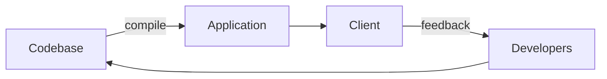

# Understanding your Client and users

One enormous misconception when deisigning an application is that these is a single client who's 
needs must be met and the process consisits of this simplified circle.

From the chart one may assume, that:

  1. There is a single box named Cient.
  2. Consumer of codebase === Client.

**Both assumptions are usually wildly unture.** 

There is no ONE client unless you code something for a single person freelancer who is at the same time the only end-user of the application. If we look at the consumenrs of codebase, then the picture becomes even wider where every consumer has it's own interests with quite a bit of conflicting expectatons.

For example consumers of a codebase can be:

* The one who pays (Client) - intersted in maximizing returns from the money paid.
* End-user groups:
  * Free user - interested in getting as much as possible, but from Client s perspective needs to be 
    one click away from everything.
  * Paid user - interested in getting everything, but from client's perspective everything is limited\
    to profitable operations.
  * Exclusive special case who has a lot of money - wants something that would be un-proffitable, but 
    has a lot of money to throw at it, makes it profitable. Into this group belong also connections and
    info-sharing with competition, that means that sometimes their access to other features might even be
    a lot more limited than paid-user.

  

