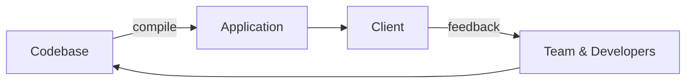
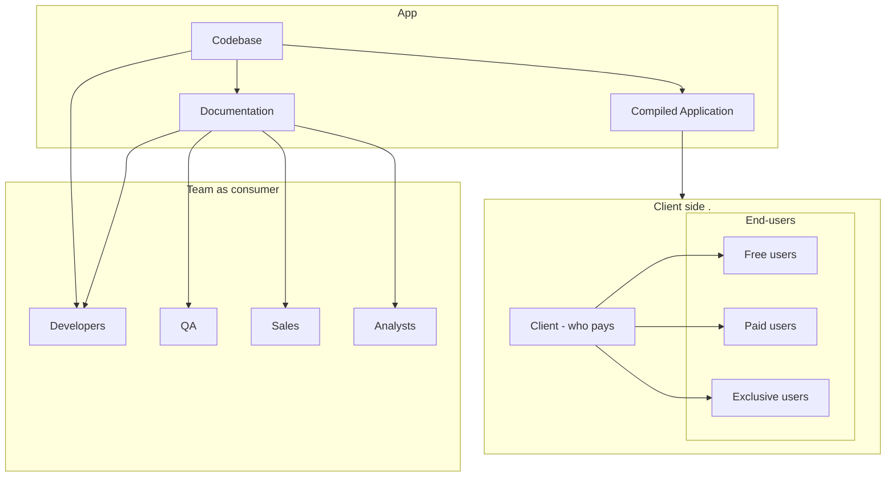

# Understanding your Client and users

One enormous misconception when deisigning an application is that these is a single client who's 
needs must be met and the process consisits of this simplified circle.

From the chart one may assume, that:

  1. There is a single box named Cient.
  2. Consumer of codebase === Client.

**Both assumptions are usually wildly unture.** 

There is no ONE client unless you code something for a single person freelancer who is at the same time the only end-user of the application. If we look at the consumenrs of codebase, then the picture becomes even wider where every consumer has it's own interests with quite a bit of conflicting expectatons.

For example consumers of a codebase can be:

* The one who pays (Client) - intersted in maximizing returns from the money paid.
* End-user groups:
  * Free user - interested in getting as much as possible, but from Client s perspective needs to be 
    one click away from everything.
  * Paid user - interested in getting everything, but from client's perspective everything is limited\
    to profitable operations.
  * The exclusive special cases who have a lot of money - wants something that would be un-proffitable, but 
    has a lot of money to throw at it, makes it profitable. Into this group belong also connections and
    info-sharing with competition, that means that sometimes their access to other features might even be
    a lot more limited than paid-user.
* Other Developers - consuming the style, architecture and documentation of codebase from another perspective
* Through architecture documentation:
  * QA
  * Sales
  * Analysts
  
So the real consumer structure is something like this:

Every consumer has its own perspective on things, and thus when processng feedback it is very important
to ask who sent it? Also keep in mind that there is not a quaranteed overlap between end-user groups. Quite
often there are features specific to just one group that is not available to others and it is not a strict hierarchy that who pays more gets more.

Development team is often forgotten from the list of actual codebase consumers, but it is a huge mistake. Your team is probably most deeply involved client of your codebase. You'll probably have to focus your 
architecture more on your own teams needs, while also matchinh other clients requirements, when you 
plan to maintain the project for a long time. And from my experience it is always good to assume the project
will become long sustained one. Designing it this way not only reduces nasty suprises when you later
need to support it, but also guides the client to actually become one if you expose a bit of your architecture
exposing that there are ways for improvements, taht the client did not know he needed before.

