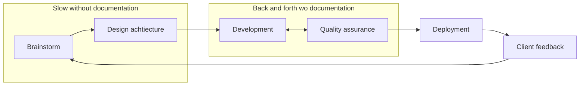

# Documenting

> ## And so the habit of not even looking for a documentation begins.

There are many types of documentation:
* for end user
* for client
* for sysadmin
* for another developer
* etc.

It is not a good idea to try to write one documentation that covers it all as the targets and thus the purpose of
documentation is completely different. This section exclusively focuses on documentation that is strictly targeted for 
other developers and analysts.

## The purpose of developer-to-developer documentation

When applications grow, so does the internal know-how about architecture and business decisions that is not really 
readable and deducible from the code and comment's alone. Also nobody has the time to actually read through and remember
the whole codebase to get the info that is deducible but scattered. In time very project gathers a pile of good ideas 
for the future that don't yet exist in the codebase, but should be left room for in the future.

Examples of what usually needs to have a separate documentation:

* Guides for new developer to get everything up and running.
* Application configuration.
* General application architecture plan and agreed upon decisions.
  * Basically everything related to business problems.
  * General data flow diagrams.
  * Explanatory guide for architecture. Programming architecture is more of a belief and gut feeling, that it will
    scale for us long term, than actual math. It will remain so until we will learn to predict the future. 
  * Style guides, naming conventions and such.
* Glossary - See [Establishing a naming convention](Naming_functions_and_variables.md).
* Architecture and data flow descriptions of sub-modules, that need to be linked from multiple places in code 
  or is just too lengthy to be written into comment.

The main purpose of a good documentation is not just to save time when onboarding new people, but also to:

 * Have a reference point for old developers to share with others, or just freshen their memory.
 * Act as a FAQ list to link and point to in internal discussions, code reviews, "how was that configured again?" questions etc.
 * Prevent code that conflicts with already established business logic or data-flows.
 * Make testing your code more beneficial and easier (testers can actually find and read markdown changes! I've seen it!)
 * Reduces time considerably in architecture phase
 * Reduces times a task is sent back and forth between QA and Development.

While writing documentation might seem as a waste of time at the phase of development, the time
is regained in other steps.

One other benefit of writing documentation is gained at the time of writing. When a new feature is in development phase I often find that it is easiest to find problems and bugs in logic when using documentation writing as [Rubber duck debugging](https://en.wikipedia.org/wiki/Rubber_duck_debugging).
## Findable up-to-date documentation

Every good project has a substantial set of additional information that needs to live somewhere.
It is extremely obvious that it needs to be besides the code, so it would be updated as code get updated.
At the same time it needs to be gathered to one simple-to-find place so everybody could access it. These two
requirements are often contradictory and result in beliefs like:

> ## There is no point in writing documentation as it get outdated quickly!

> ## There is no point in writing documentation as nobody reads it anyway!

Following is not something of a magic bullet, but a thing that seems to work for me currently, to tackle both of
these problems. 

Iv'e tried all kinds of ways to make these 2 points work together, in various ways and only the ones where documentation of an 
app exists in the same repository as code, actually got updates when code was updated. The reason for this is mostly because:

  1. Developer probably read the comment or documentation linked to the piece of code updates, so knew of its existence.
  2. easier to actually update the documentation (in the same branch and commit flow)
  3. Can be reminded in the phase of code-review.

One way to structure documentation as close to code as possible is to write it in markdown besides the module that is covers and keep a consistent well known filename thar everybody knows. "README.md" has become 
the current standard of choice everywhere, so it is advised to use this file name. Most version management system
user interfaces even know to bring forward these files. There is also a need for an entry point documentation
file, that is also a README.md usually kept at root. With growth of application comes also the need to write down the knowledge that is not a single module specific, but cover whole application or is even outside of application current codebase, but should be known when developing.

