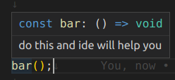

# Commenting

Countless times I've heard this *cliché* phrase:

> “Good code is self-documenting.”

Though there is some truth to it, it has been mostly abused, without actually knowing what it means, as an excuse 
to skip commenting and documenting. Even the best self-documenting code needs additional documentation and commenting.

Very often this phrase is used referring to really bad and toxic examples of code commenting.
I'm referring to commenting the obvious.

**Do not do this!:**

```javascript
// Declare count variable
let count = 0;

// loop 5 times
for (let i = 1; i <= 5; i++) {
  
  // increase count by 1
  count++;

}

// An array of names
let a = ["Alice", "Bob", "Charlie"]
```

All these comments are just useless and meaningless as they just duplicate the code that can be
as easily be read from code itself.

When commenting for javascript JSDoc style comments but enriched with markdown syntax is usually the best option, as
most IDEs know how to display the information using tooltips about a method or variable below it, even
when it is imported from another file. Also markdown allows links to other files and more.

```javascript
// Instead of this,
const foo = () => {}

/** do this and ide will help you */
const bar = () => {}
```



## Meaningful comments

Here are some examples of where and how to use commenting, so it would have a purpose and actually complement
Your code:

### 1. Provide some "Insider" information

Providing some information about why the code exists, that can not be read directly from the code, is one of the best
ways comments can be utilized. Very often these places in code are overlooked, as the writer of the code has just read
the task at hand, where the same lines are probably present. Thus it seems un-necessary to repeat them here.

This is a mistake though, as another developer later reading the code needs to find the task that these lines refer to
from project management system or just plain guess and hope he's right. This generates a lot of wasted time and
interrupts the code reading flow. Also some the might have been fixed or improved by later commits, making finding
the initial task really displeasing.


**Good examples of comments:**

  ```typescript
  /**
   * Returns if user has sufficient permissions for given app id (true/false)
   * If appId is configured in `api/rw/2/conf/shared/applications` but has no `rolesAll` or `rolesAny`, returns `true`.
   * If app is not configured in `api/rw/2/conf/shared/applications`, returns `true`.
   */
  function* isValidApp(appId: string): Generator<any, boolean, any> {
    //...
  ```

  ```javascript

  /** Missing value criteria:
  *
  * `columnId` has translations (object not nullish)
  * `columnId` has `values` translations present (non nullish)
  * `valueId` is missing in `values` list
  * 
  * For columns that are untranslatable (defined by `values` parameter nullish)
  * we currently do not detect and show missing values in UI.
  **/
  let valueIsMissing = false;
  if (attributeTranslation?.values) {
    if (isTranslationValue(value)) {
      valueIsMissing = !(
        Object.values(attributeTranslation.values).find(v => v.translation === value.translation)
      );
    } else {
      valueIsMissing = !(attributeTranslation?.values?.[value.valueId]);
    }
  }
  ```

  Very often the reason finding is skipped by next developer and blind updates and fixes are made to code using just 
  guesswork. Keep in mind that whoever reads it can see what it does, but may not know if it is what the code should do, 
  in case there is an error in code, and why. This can result in conditions and pieces of code left behind that are
  never utilized or even do something plain stupid. These left-behind lines will make the code even harder to understand
  for next developers snowballing into a disaster. Also it would be much harder for another developer to see that maybe
  the task at hand is already conflicting with existing code.

### 2. Provide short summary for a lengthy or difficult to read block
 
Comments can also be used to shorten code reading time and improve discover-ability by providing reader with short
insight to what a lengthy method or piece of code does. With good short comment, reading through the whole code could be
skipped to understand its function.

```javascript
/** 
 * Does 1d breakdowns from database for getting `population` values and 
 * converts results from slow to handle array formats to hashmaps for fast access.
 */
function breakdown1DAsMap(breakdownColumnIds, filter) {
  // ...
}
```

Some difficult to read  code, like regular expressions or fast binary manipulations, just cry out to be backed by
a comment describing exactly how the code should work. It is very easy to make a mistake in a difficult to read
code, and very hard to actually read from code later what part was intended and what was an undesired side-effect,
a simple comment can really save the day here:

```javascript
/** Regexp matcher for float range inputs
  * 
  * Matches if string is it is one of the following:
  * <-3.3
  * >-4
  * <=4
  * >=-3
  * 2..5
  * -100.23..-1.2
  * 
  * all numbers can also have suffixes (2k..10k)
  *    * k - kilo
  *    * M - mega
  *    * G - giga
  *    * B - for additional byte notation like KB or MB
  *    * T - tera
  *    * P - peta
  *    * E - exa
  */
const REGEX_VALID_MATCH = /^(((<|>|<=|>=)?\s*(-?\d+(\.\d+)?([kMGBTPE])?))|((-?\d+(\.\d+)?([kMGBTPE])?)\s*\.\.\s*(-?\d+(\.\d+)?([kMGBTPE])?)))$/;
```

### 3. Describe pitfalls of your code

If a method or code blocks has some known limitations when used or developed further, it is a good idea to include a
comment for the next developer.

Example:

```javascript
 /**
   * This method should just return anchor element position relevant info
   * and should not do any mutations or expensive logic.
   * For it is called very often.
   */
const getAnchorBBox = () => {
  // ..
```

Sometimes the limitation is not in the code itself but in design. Crossing that design and extending the code beyond its
given design may break places where it is already used or planned to be used.

Lets consider for example a Dropdown React component: a component that should place a positioned box with given contents to
the side of a reference element.

```javascript

/**
 * A react component that renders a positioned and styled element next to a given reference element.
 * 
 * It is designed to unify all dropdowns in application to have same style shadows, corners and tick element, thus
 * giving different styles to the component is not expected to be implemented here.
 * 
 * It t is expects to be given all its content via `children` prop not provide any padding by
 * itself. The padding should be provided by children.
 * 
 *   <Dropdown>
 *    <div className="my-header">
 *       Header
 *      </div>
 *     <div className="my-padded-content">
 *       Content
 *      </div>
 *   </Dropdown>
 * 
 * It stretches to fit the content elements.  
 */
class Dropdown extends PureComponent {
//...
}
```

By these comments next developer can easily see what the Dropdown module is designed to do and knows not to:
  
  * Overwrite its styles or add paddings into this component when designer gives instructions for style changes
  * Fix dropdown size with some css parameters and use these styles on children instead.

If a common module with incompatible overlay rules are still needed, one can always make a new class that extends this class.

### 4. JSdoc your interface and data properties - especially the optional and too generic ones.

I've heard a lot lately that instead of commenting and documenting, use Typescript. I agee that Typescript does a
really good job of what it was designed to do: keeping away javascript typecasting errors and allowing developers to
fortify their modules against bad input. It does not however replace good commenting. 
You can think of it this way: knowing that a square block will fit into a square hole is not telling you much about
what will happen if done so.

Even further typescript does not help you at all with optional properties - you do not 
know what will happen if omitted. Without reading through the code it is impossible to tell if some default used instead,
maybe some functionality limited or event behavior changed.

Typescript does play well with JSDoc comments making them visible not only from type tooltip but also from instances 
created from this type, so when using TypeScript commenting type properties is usually the simplest.

**This is why you should comment optional properties:**
```typescript
export type SuperFiltersState = {
  /** Stores the current filter object that user is editing */
  filter: LogicGroupDefinition;

  /** Defines the selected element in filters.
   * If `undefined` nothing is selected and this side-panels are closed  */
  selectedFilterObjPath?: string,

  /** Defines the picked/selected database column currently in edit`{tableType, tableId, columnId}`
   * If `undefined`, no column yet picked */
  selectedEditColumn?: GroupColumnConf,

  /** Contains filter allowed groups and columns conf as it is given by user - comes from mongo.
   * Does not mean that all groups or columns are shown as user might not have permissions or the columns might not exist
   * anymore in database.
   * When `undefined` UI will not be displayed and initialized.
  */
  groupsConf?: GroupsConf,
```

Sometimes the type of an interface property is just too generic to actually know what you should put
in there. Look at the properties! Do you really know what you should put in there without reading the code?

```typescript
type SpinnerProps = {
  size: number;
  stroke: string;
  strokeWidth: number;
};

class Spinner extends PureComponent<SpinnerProps> {
  // ...
```

With comments it becomes a lot clearer:

```typescript
type SpinnerProps = {
  /** Diameter of spinner circle in pixels */
  size: number;

  /** Color of spinner circle border: ex "red" or "#FF1234" */
  stroke: string;

  /** Thickness of spinner circle border in pixels */
  strokeWidth: number;
};

class Spinner extends PureComponent<SpinnerProps> {
  // ...
```

# Documenting